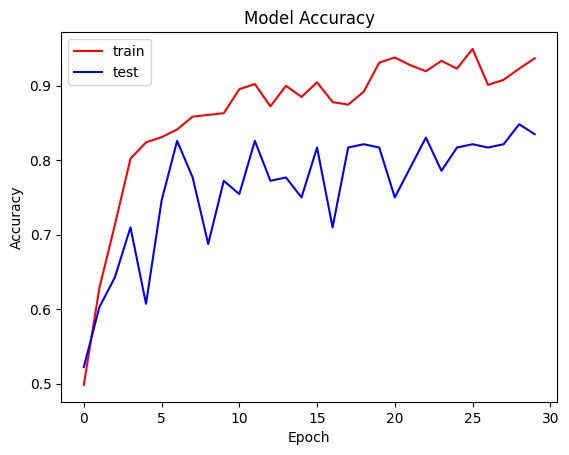
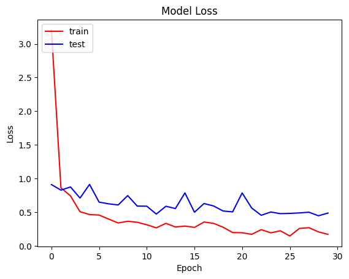
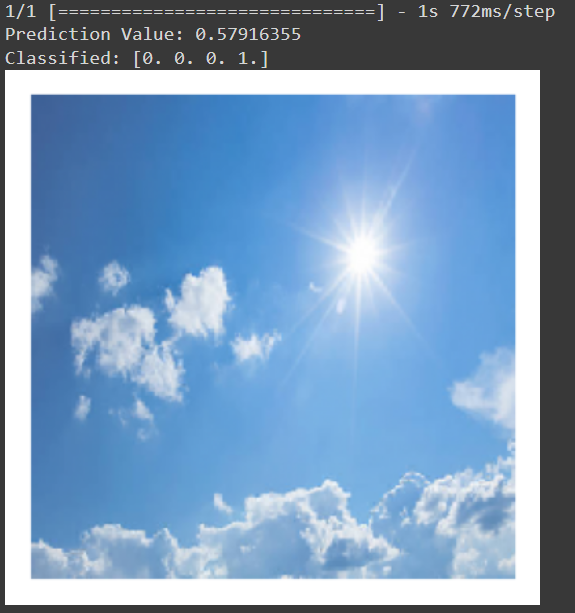
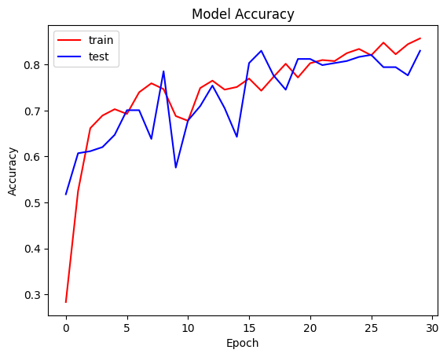
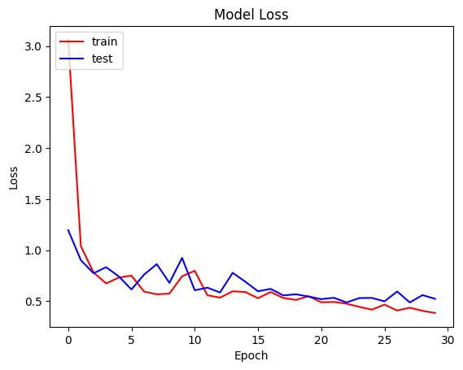
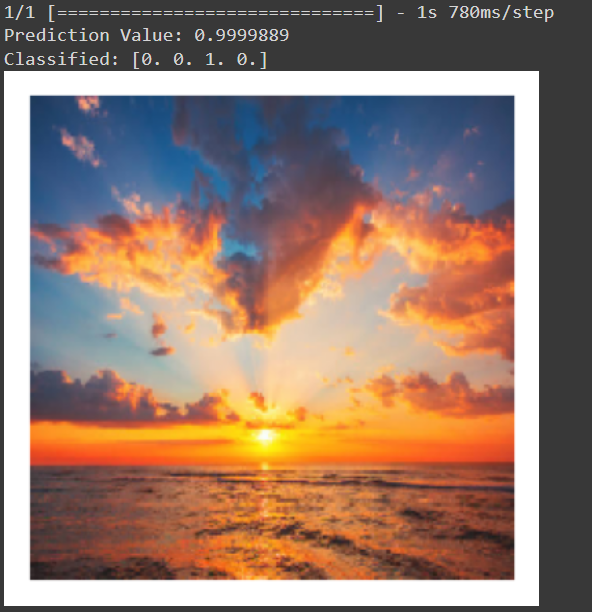

# Weather Image Classification with CNN 

<p style='text-align:center;'>
</p>

This project is part of the final delivery for the seminar "Selected Topics in Computational Physics: Introduction to Neural Networks", from the 2023-2 period. The chosen topic was image classification, which falls within the field of Computer Vision. In general, Computer Vision focuses on developing algorithms and techniques that enable machines to understand, analyze, and interpret images and videos in a manner similar to humans.

Image classification is one of the most common and fundamental tasks in the field of Computer Vision. It involves assigning a label or category to a given image, which requires recognizing specific visual patterns and features in the image to perform classification.

The problem of this project involves classifying weather images into four categories: cloudy, rainy, sunrise, and sunny, using a Convolutional Neural Network (CNN). The dataset used for this project can be found [here](https://www.kaggle.com/datasets/pratik2901/multiclass-weather-dataset).

The dataset provides a platform for outdoor weather analysis by extracting various features to recognize different weather conditions.

The objectives of the project are:
* Loading the dataset and exploring the data
* Data preprocessing
* Training two CNN models

## Loading the Dataset and Exploring the Data

To load the dataset, we created a function called `weather_path`, which aims to generate the directory path containing weather data for each type of weather condition.

```python
def weather_path(base_path, weather_type):
    '''
    Function to construct the full path of files for a specific weather type.
    
    Parameters:
        - base_path (str): The base directory path where weather data is stored.
        - weather_type (str): The type of weather ('Cloudy', 'Rain', 'Shine', 'Sunrise').
        
    Returns:
        - str: The full path to the directory corresponding to the given weather type.
    '''
    # Concatenate the base path with the weather type to form the full path
    full_path = f"{base_path}/{weather_type}"
    return full_path
```

### Data Exploration

To understand the distribution of data for each category with their respective labels, we created the function `count_weather_classes`.

```python
def count_weather_classes(base_path):
    '''
    Function to count the number of files in each weather class directory.
    
    Parameters:
        - base_path (str): The base directory path where weather data is stored.
        
    Returns:
        - pandas.DataFrame: A DataFrame containing the labels (weather classes) and the number of files in each class.
    '''
    # Get the list of directories (weather classes) in the base path
    files = os.listdir(base_path)
    
    # Count the number of files in each weather class directory
    num_weather = [len(os.listdir(os.path.join(base_path, x))) for x in files]
    
    # Create a DataFrame with labels (weather classes) and the corresponding number of files
    weather_df = pd.DataFrame({'labels': files, 'num_weather': num_weather}).sort_values('num_weather', ascending=False)
    
    return weather_df
```

To visually explore their distribution, we created the function `bar_plot`.

```python
def bar_plot(class_counts, col1, col2):
    '''
    Function to create a bar plot based on weather class counts.
    
    Parameters:
        - class_counts (pandas.DataFrame): DataFrame containing the weather class counts.
        - col1 (str): Name of the column in the DataFrame to use for the plot data.
        - col2 (str): Name of the column in the DataFrame to use for the plot data. 
    Returns:
        - None
    '''
    plt.bar(class_counts[col1], class_counts[col2])
    plt.title('Numbers of weather type')
    plt.xlabel('Weather')
    plt.ylabel('Count')
    plt.show()
```

To visualize the data shape, i.e., the size of the images, we designed the following function called `view_picture`.

```python
def view_picture(File, weather_type):
    '''
    Function to view a sample of images in a directory with corresponding weather type titles.
    
    Parameters:
        - File (str): The directory path containing the images.
        - weather_type (str): The type of weather for the images.
        
    Returns:
        - None
    '''
    # Create a figure with a 3x3 grid of subplots
    plt.figure(figsize=(8, 8))
    
    # Loop through the first 9 images in the directory
    for i in range(9):
        plt.subplot(3, 3, i + 1)  # Select the next subplot
        image = plt.imread(os.path.join(File, os.listdir(File)[i]))  # Read the image
        plt.imshow(image)  # Display the image
        plt.title(weather_type)  # Set the title to the weather type
        
    plt.show()  # Show the plot
```

## Data Preprocessing 

For the data preprocessing stage, which involved resizing the images and evenly distributing the training and testing data, we created the following function:

```python
def create_data_generators(dataset_path, target_size=(250, 250), batch_size=32, validation_split=0.2):
    '''
    Function to create data generators for training and validation.
    
    Parameters:
        - dataset_path (str): The directory path containing the dataset.
        - target_size (tuple): The dimensions to which all images will be resized.
        - batch_size (int): The batch size for training and validation.
        - validation_split (float): The fraction of the data to use for validation.
        
    Returns:
        - tuple: A tuple containing the training and validation data generators.
    '''
    # Define the image data generator with specified augmentation parameters
    data_generator = ImageDataGenerator(rescale=1. / 255,
                                        shear_range=0.2,
                                        zoom_range=0.2,
                                        horizontal_flip=True,
                                        validation_split=validation_split)
    
    # Create the training data generator
    train_generator = data_generator.flow_from_directory(
        dataset_path,
        target_size=target_size,
        batch_size=batch_size,
        class_mode='categorical',
        subset='training'
    )
    
    # Create the validation data generator
    validation_generator = data_generator.flow_from_directory(
        dataset_path,
        target_size=target_size,
        batch_size=batch_size,
        class_mode='categorical',
        subset='validation'
    )
    
    return train_generator, validation_generator

## CNN Models

In this project, we developed two CNN models for image classification. We implemented the `train_sequential_model` function with the following parameters:

* `network_arch` (dict): A dictionary specifying the architecture of the CNN model. Each layer is defined with its number of units (`n_units`) and activation function (`activation`).
* `input_shape` (tuple): Tuple indicating the shape of the input images.
* `train_generator`: Generator for training data.
* `validation_generator`: Generator for validation data.
* `optimizer` (str): Name of the optimizer to use during training.
* `loss` (str): Name of the loss function to minimize.
* `epochs` (int): Number of epochs for training.
* `batch_size` (int): Batch size for training and validation.
* `steps_per_epoch` (int): Number of steps per epoch.
* `validation_steps` (int): Number of steps for validation.

```python
def train_sequential_model(network_arch, input_shape, train_generator, validation_generator,
                           epochs=10, optimizer="adam", loss="categorical_crossentropy",
                           batch_size=32, steps_per_epoch=None, validation_steps=None):
    """
    Function to build and train a sequential model.
    
    Parameters:
        - network_arch (dict): Dictionary specifying the architecture of the CNN model.
        - input_shape (tuple): Shape of the input images.
        - train_generator: Generator for training data.
        - validation_generator: Generator for validation data.
        - optimizer (str): Optimizer to use during training.
        - loss (str): Loss function to minimize.
        - epochs (int): Number of epochs for training.
        - batch_size (int): Batch size for training and validation.
        - steps_per_epoch (int): Number of steps per epoch.
        - validation_steps (int): Number of steps for validation.
        
    Returns:
        - Compiled model
        - History object containing training history.
    """
    # Set the seed for reproducibility
    np.random.seed(123)
    tf.random.set_seed(123)
    
    # Create the model
    model = Sequential()
    
    for k, layer in network_arch.items():
        n_units = layer.get("n_units")
        activation = layer.get("activation", "relu")
        if k == "layer_1":
            model.add(Conv2D(n_units, (3,3), strides=(1,1), padding='same', activation=activation, input_shape=input_shape))
        else:
            model.add(Conv2D(n_units, kernel_size=(3,3), strides=(1,1), padding='same', activation=activation))
        if 'Dropout' in layer:
            model.add(Dropout(layer['Dropout']))
        if 'MaxPool2D' in layer:
            model.add(MaxPool2D(pool_size=layer['MaxPool2D']))
    
    model.add(Flatten())
    model.add(Dense(200, activation='relu'))
    model.add(Dropout(0.3))
    model.add(Dense(4, activation='softmax'))
    
    # Print model summary
    print(model.summary())
    print()
    
    # Compile the model
    model.compile(optimizer=optimizer, loss=loss, metrics=['accuracy'])
    
    # Train the model
    history = model.fit(train_generator, validation_data=validation_generator,
                        epochs=epochs, batch_size=batch_size,
                        steps_per_epoch=steps_per_epoch, validation_steps=validation_steps)
    
    return model, history
```

We defined the architecture using a dictionary called `network_architecture`:

```python
network_architecture = {
    "layer_1": {"n_units": 64, "activation": "relu"},
    "layer_2": {"n_units": 128, "activation": "relu", "Dropout": 0.3, "MaxPool2D": (2, 2)},
    "layer_3": {"n_units": 256, "activation": "relu", "Dropout": 0.3, "MaxPool2D": (2, 2)},
    "layer_4": {"n_units": 512, "activation": "relu", "Dropout": 0.3, "MaxPool2D": (2, 2)}
}
```

We also defined the number of epochs, steps per epoch, and validation steps:

```python
epochs = 30
steps_per_epoch = 901 // 32
validation_steps = 224 // 32
```

To evaluate the model in terms of loss and accuracy, we implemented the `evaluate_model` function:

```python
def evaluate_model(model, data_generator):
    """
    Function to evaluate the model on a dataset and display the loss and accuracy.

    Parameters:
        - model: The TensorFlow/Keras model.
        - data_generator: The data generator to evaluate the model.

    Returns:
        - None
    """
    loss, accuracy = model.evaluate(data_generator)
    print(f"Loss: {loss*100:.2f}%")
    print(f"Accuracy: {accuracy*100:.2f}%")
```

### Results of Model 1

**Accuracy Graph**




**Loss Graph**



**Prediction**



For the second model, we defined the following architecture:

```python
modelcnn2_architecture = {
    "layer_1": {"n_units": 64, "activation": "relu"},
    "layer_2": {"n_units": 128, "activation": "relu"},
    "layer_3": {"n_units": 128, "activation": "relu", "MaxPool2D": (2, 2), "Dropout": 0.3},
    "layer_4": {"n_units": 128, "activation": "relu"},
    "layer_5": {"n_units": 256, "activation": "relu"},
    "layer_6": {"n_units": 256, "activation": "relu"},
    "layer_7": {"n_units": 256, "activation": "relu", "MaxPool2D": (2, 2), "Dropout": 0.3},
    "layer_8": {"n_units": 4, "activation": "softmax"}
}
```

### Results of Model 2

**Accuracy Graph**



**Loss Graph**



**Prediction**


